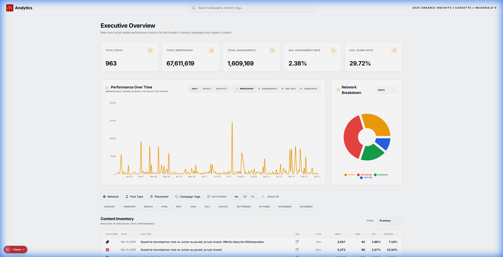
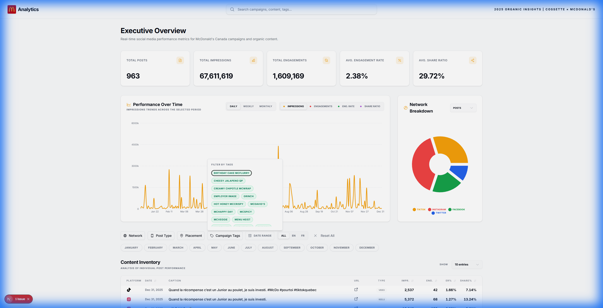
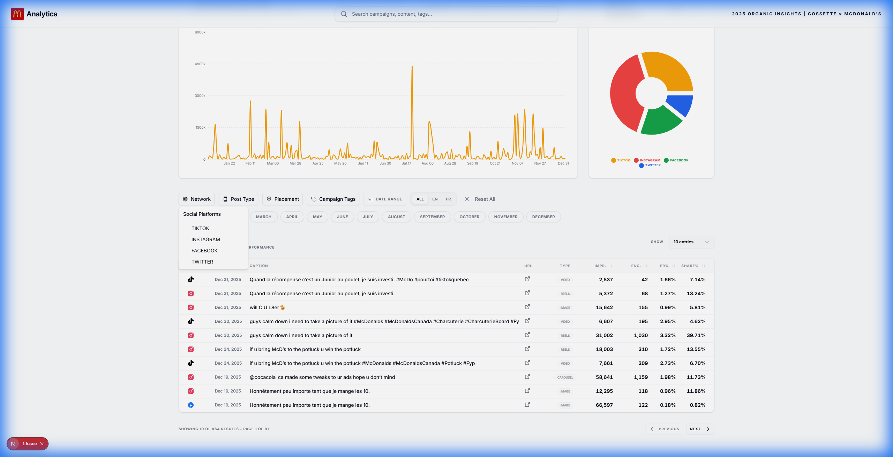

<h1 align="center">🍟 McDonald's Organic Insights Dashboard</h1>

<p align="center">
  <strong>A premium, real-time analytics dashboard for tracking organic social media performance across TikTok, Instagram, Facebook, and Twitter.</strong>
</p>

<p align="center">
  Built with Next.js 16 • React 19 • Tailwind CSS • Recharts
</p>

<h3 align="center">
https://mcd2025.vercel.app/
</h3>

---

## 📊 Overview

The **McDonald's Organic Insights Dashboard** is a high-performance, beautifully designed analytics platform created for **Cossette × McDonald's** to monitor and analyze organic social media content performance. It transforms raw CSV exports into actionable insights through elegant visualizations, advanced filtering, and detailed content breakdowns.

This dashboard was built to provide marketing teams with:
- **Real-time performance metrics** across all major social platforms
- **Interactive data exploration** with multi-dimensional filtering
- **Content-level insights** for optimizing future campaigns
- **Executive-ready visualizations** for stakeholder presentations

---

## ✨ Features

### 📈 Executive Overview
- **Four Key Performance Indicators**: Total Posts, Total Impressions, Total Engagements, and Average Engagement Rate — displayed in prominent stat cards with trend indicators.

### 📉 Performance Over Time
- **Interactive Area Chart**: Visualize any metric (Impressions, Engagements, ER%, Shares, Share Ratio) over time with smooth animations.
- **Time Granularity**: Toggle between Daily, Weekly, and Monthly aggregations.

### 🍩 Network Breakdown
- **Donut Chart Visualization**: See how metrics are distributed across platforms (TikTok, Instagram, Facebook, Twitter).
- **Metric Selector**: Dynamically switch between Impressions, Engagements, Shares, ER%, and Share Ratio.

### 🎯 Advanced Filtering
- **Multi-Select Filters**: Filter by Network, Post Type, Placement, and Campaign Tags.
- **Emerald Chip Tags**: Beautifully styled campaign tag chips with instant feedback.
- **Date Range Picker**: Select custom date ranges with a dual-month calendar.
- **Language Toggle**: Filter by English, French, or All content.
- **Month Selector**: Quickly filter by specific months with pill-button UI.
- **Global Search**: Find posts by keyword across captions and tags.

### 📋 Content Inventory Table
- **Sortable Columns**: Click any header to sort by Date, Impressions, Engagements, ER%, or Share Ratio.
- **Boosted Post Highlighting**: Paid/boosted posts are highlighted in rose and tagged with a "BOOSTED" badge.
- **Tabular Numbers**: All numeric data uses fixed-width digits for perfect vertical alignment.
- **Pagination**: Navigate through large datasets with customizable page sizes (10, 25, 50, 100 entries).

### 🎨 Premium UI/UX
- **Modern Design System**: Glassmorphism, subtle shadows, and smooth micro-animations.
- **Responsive Layout**: Optimized for desktop and large-screen displays.
- **Centered Search Bar**: Prominent global search in the navbar.
- **Custom McDonald's Branding**: Integrated McDonald's SVG logo.

---

## 🖼️ Screenshots

<details>
<summary><strong>📊 Dashboard Overview</strong></summary>
<br>

<p><em>The main dashboard view showing stat cards, performance chart, network breakdown, and filters.</em></p>
</details>

<details>
<summary><strong>🏷️ Filter Interactions</strong></summary>
<br>

<p><em>The Campaign Tags filter with emerald-styled chips for intuitive multi-select filtering.</em></p>
</details>

<details>
<summary><strong>📋 Content Inventory Table</strong></summary>
<br>

<p><em>The detailed content table with sortable columns, Share Ratio, and tabular number formatting.</em></p>
</details>

---

## 🛠️ Tech Stack

| Category | Technology |
|----------|------------|
| **Framework** | [Next.js 16](https://nextjs.org/) (App Router, Turbopack) |
| **UI Library** | [React 19](https://react.dev/) |
| **Styling** | [Tailwind CSS 4](https://tailwindcss.com/) |
| **Components** | [shadcn/ui](https://ui.shadcn.com/) |
| **Charts** | [Recharts](https://recharts.org/) |
| **Icons** | [Phosphor Icons](https://phosphoricons.com/) |
| **Date Handling** | [Day.js](https://day.js.org/) |
| **CSV Parsing** | [PapaParse](https://www.papaparse.com/) |
| **Typography** | [Inter Variable](https://rsms.me/inter/) via @fontsource |
| **Language** | [TypeScript 5](https://www.typescriptlang.org/) |

---

## 🚀 Getting Started

### Prerequisites
- **Node.js** 18.17 or later
- **npm** 9+ or **pnpm** 8+

### Installation

1. **Clone the repository:**
   ```bash
   git clone https://github.com/parthshahanand/csv-dash.git
   cd csv-dash
   ```

2. **Install dependencies:**
   ```bash
   npm install
   ```

3. **Add your data:**
   Place your CSV file in the `public/` directory as `mcd-data.csv`. The expected columns are:
   - `Network`, `Post Type`, `Published At`, `Placement`, `Reach`, `Impressions`, `Engagements`, `Engagement Rate`, `Shares`, `Text`, `URL`, `Language`, `Tags`

4. **Start the development server:**
   ```bash
   npm run dev
   ```

5. **Open in browser:**
   Navigate to [http://localhost:3000](http://localhost:3000)

### Production Build

```bash
npm run build
npm start
```

---

## 📁 Project Structure

```
csv-dash/
├── public/
│   ├── mcd-data.csv          # Your source data
│   └── favicon.png           # Custom favicon
├── src/
│   ├── app/
│   │   ├── layout.tsx        # Root layout with SEO
│   │   ├── page.tsx          # Main dashboard page
│   │   └── globals.css       # Global styles & design tokens
│   ├── components/
│   │   ├── app-shell.tsx     # Layout wrapper with navbar
│   │   ├── stat-cards.tsx    # KPI cards
│   │   ├── performance-chart.tsx
│   │   ├── network-breakdown.tsx
│   │   ├── filters-bar.tsx   # All filter controls
│   │   ├── posts-table.tsx   # Content inventory table
│   │   └── ui/               # shadcn/ui components
│   ├── lib/
│   │   ├── data-context.tsx  # Global state & filtering logic
│   │   └── csv-parser.ts     # CSV parsing utilities
│   └── types/
│       └── post.ts           # TypeScript interfaces
├── docs/
│   └── screenshots/          # README images
├── components.json           # shadcn/ui config
└── tailwind.config.ts
```

---

## 📧 Contact

For questions, feedback, or collaboration inquiries:

📩 [parth.shahanand@cossette.com](mailto:parth.shahanand@cossette.com)

---

## ⚠️ Disclaimer

> This project was built using **Google Antigravity**, an AI-powered coding assistant. While every effort has been made to ensure quality and accuracy, please review all code before deploying to production environments.

---

<p align="center">
  <sub>© 2025 Cossette × McDonald's. All rights reserved.</sub>
</p>
